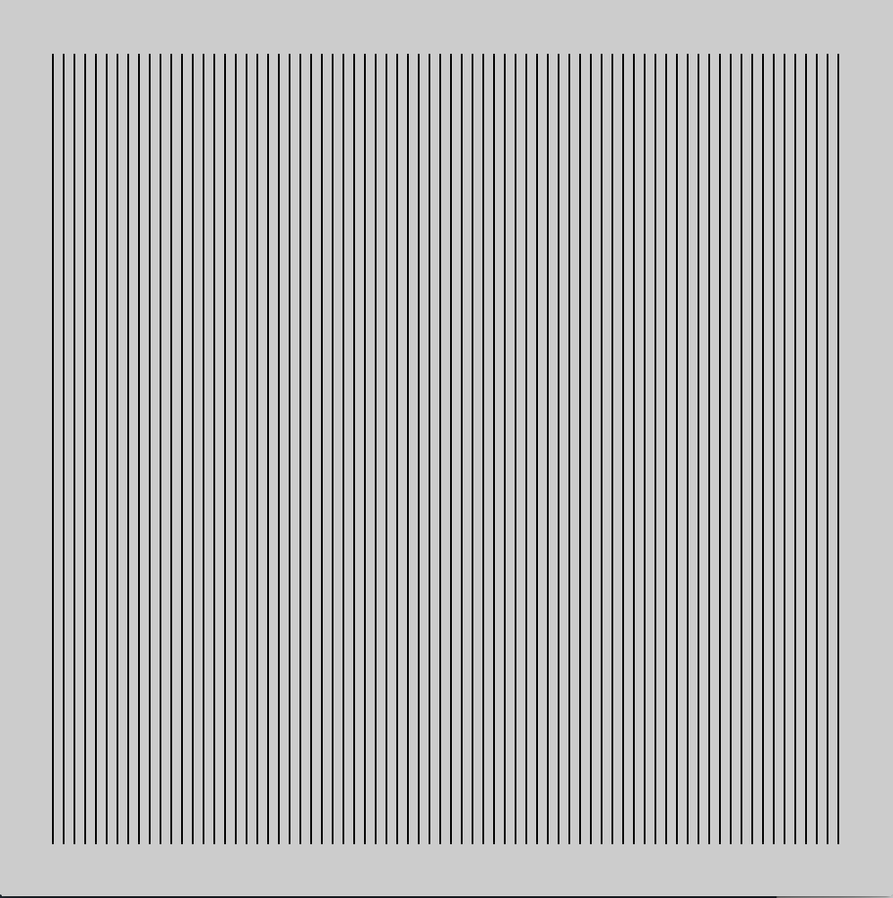
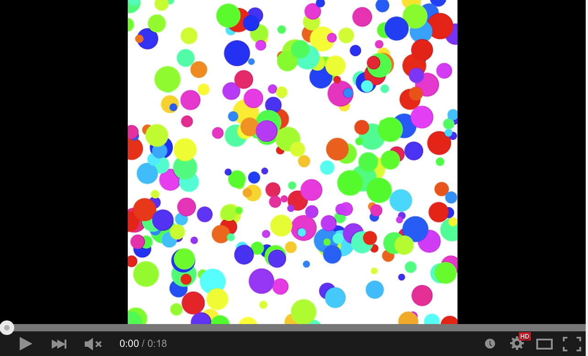
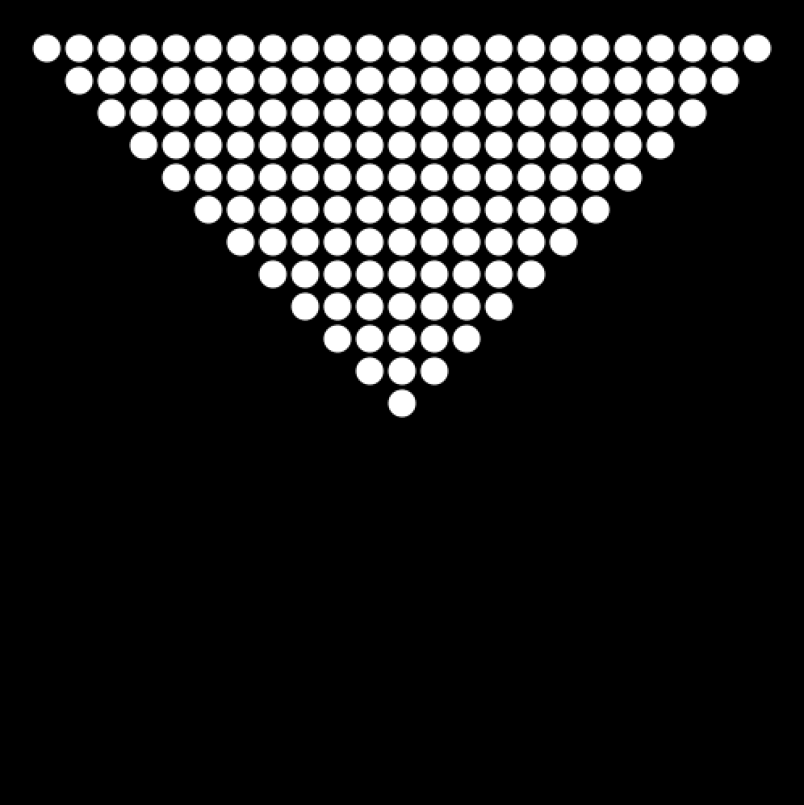
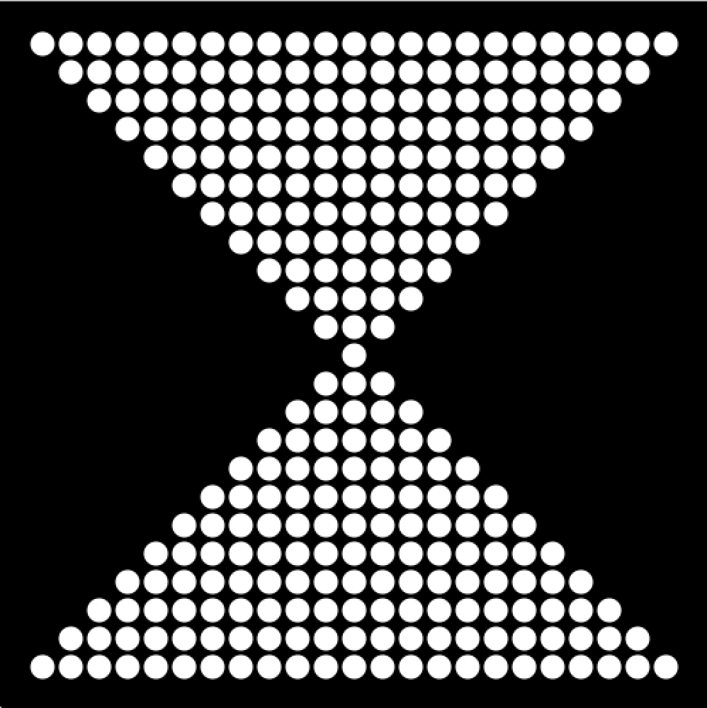
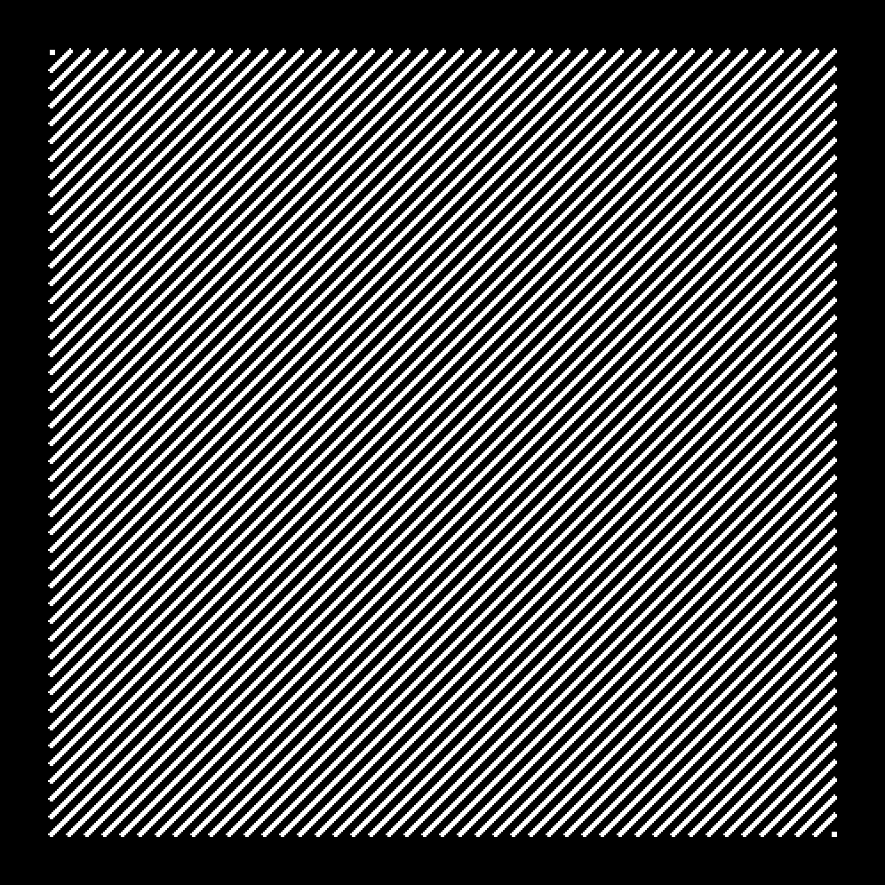
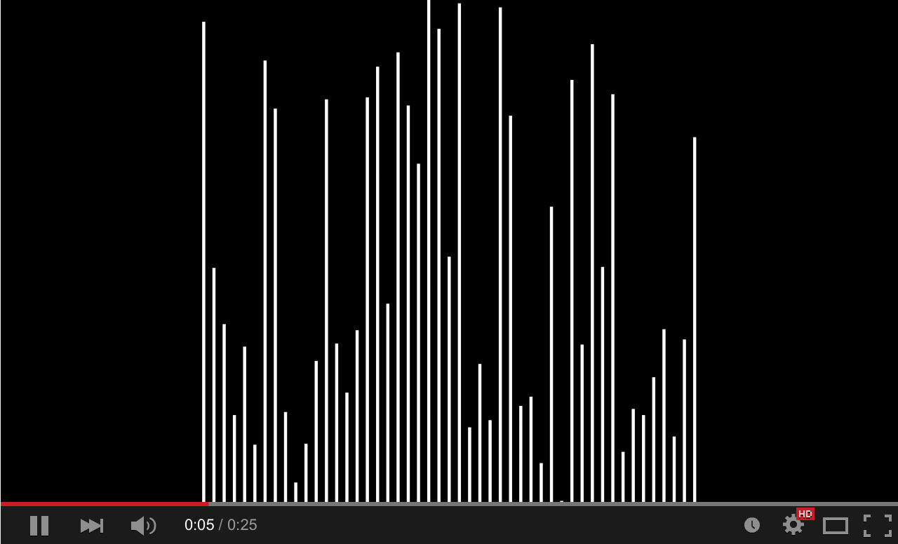

# CCA Programming & Electronics, Spring 2015

This course repository contains homework assignments, useful guides, and code for "Programming & Electronics" at CCA, Spring 2015.

### Week 1: Wednesday, January 21, 2015

Lecture:
- Inspirational Videos
- Introductions
- Goals & course details

Hands-on:
- Human Embodiment of Programmer & Robot
  - Programs generally run line-by-line.
  - While loops, if statements, and functions break that up.
- A quick look at the Remote Control Robot code

Videos:
- Basic robots
  - [Coffee-can robot](http://www.youtube.com/watch?v=b0mIshBIbvI#t=24)
  - [Tree-climbing robot](http://www.youtube.com/watch?v=zkpH1BjD6Wc)
  - [Self-balancing robot](http://www.youtube.com/watch?v=Tw9Jr-SPL0Y)
  - [Insect robot](http://www.youtube.com/watch?v=tOsNXg2vAd4#t=120)
  - [Treadbot](http://www.youtube.com/watch?v=YblSltHDbIU)
  - [Velociraptor robot](http://www.youtube.com/watch?v=lPEg83vF_Tw)
- Drink-makers
  - [Textspresso](http://www.youtube.com/watch?v=kx9D74t7GD8#t=89)
  - [The Inebriator](http://www.youtube.com/watch?v=WqY7fchs7H0)
- Art bots
  - [Floating Couch](http://vimeo.com/72826106)
  - [Wooden Segment Mirror](https://www.youtube.com/watch?v=BZysu9QcceM#t=36)
  - [Cubli: Floating Cube](https://www.youtube.com/watch?v=n_6p-1J551Y)
  - [Arc-o-matic](http://vimeo.com/57082262#at=130)
  - [Robo Faber](http://vimeo.com/78771257)
  - [Eggbot](https://www.youtube.com/watch?v=w4cdbV2oaEc)
- Computer Numerical Control (CNC)
  - [Shapoko / tinyg](http://www.youtube.com/watch?v=pCC1GXnYfFI#t=11)
  - [Makerbot Replicator](http://www.youtube.com/watch?v=NAbiAzYhTOQ)
- Music
  - [Laser harp](http://www.youtube.com/watch?v=sLVXmsbVwUs#t=20)
- Vacuuming
  - [Roomba](https://www.youtube.com/watch?v=0DNkbZvVYvc)

#### Homework 1 (due Wednesday, January 28, 2015)

- Solve the puzzles through level 5 at [Rudy the Red Dot](http://rudy.zamfi.net) -- these are the puzzles we solved together using "pseudocode" in class, but now you will solve them with actual code, in JavaScript. 
  
  *(The website is running on my computer at home, so it may load a bit slowly. Also, if the <strong>Run</strong> button seems to stop working, reload the page. Best results with the Chrome browser.)*

    - For puzzles that change, each time you hit the **Run** button, you'll get a new version of the puzzle. Your code should solve any variation of the puzzle you can get. Start by clicking **Run** a few times to make sure you remember what the possible variations are.
    - There's a cheat sheet of syntax on the right, under the puzzle itself.
    - **Assignment: Use at least 3 functions of at least 3 lines each while computing these puzzles.**
    - **Assignment: Use a while loop for puzzles 4 and 5.**
    - **Assignment: Email me a link to your final level (not the code, the actual URL link -- like http://rudy.zamfi.net/whatever) to [jzamfirescupereira@cca.edu](mailto: jzamfirescupereira@cca.edu) with subject RUDY FINAL LEVEL LINK by 11am, Wednesday January 28.**

- If you find yourself struggling with the basic concepts of the code, complete through puzzle 20 at [Hour of Code](http://learn.code.org/hoc/1) -- make sure you click the **Show Code** button after solving each puzzle and that you understand how that code works.

- Install [Processing](https://processing.org/download/?processing) on your computer.

- **Assignment: Follow the first 5 [Processing tutorials](https://processing.org/tutorials/)**

- **Assignment: Get extra help by going to the Hybrid Lab during staffed hours (I believe 10am-8pm) and asking the coaches for help!**

- **Assignment: Bring your computer to class on Wednesday, January 28!**

Please email me at [jzamfirescupereira@cca.edu](mailto: jzamfirescupereira@cca.edu) if you're stuck, aren't sure how to move forward, or just want to say hi! (And if you're stuck on Rudy, include the URL link to the puzzle you're stuck on!)

### Week 2: Wednesday, January 28, 2015

Lecture:
- Homework Review

Lab:
- Creating sketches. Write code to create the following sketches in Processing:

1. 

2. 

3. 

4. 

5. 

6. Look through the [Processing reference](http://processing.org/reference). Pick a function, and use it in a new sketch of your own choosing.

#### Homework 2 (due Wednesday, February 4, 2015)

Programming Practice!

- **Assignment: Pick 5 of the 15 sketches below and recreate them, at least one must be animated.** Bonus points for adding flourishes to your sketches.

- Not all these sketches are equally difficult -- in fact some are very challenging!

- If you didn't follow the [Processing tutorials](https://processing.org/tutorials/) last week, then **Assignment: Do so now!**

1. Circles in a diagonal line. Use a while loop to draw the balls in sequence. What do you know about the x and y coordinates of each ball? (Spoiler: They're the same!)
   
   

2. Circles in a grid. You will likely need a while loop inside another while loop!
   
   

3. Colored circles in a grid, random version. Check out the `colorMode` function, and HSB, in the [Processing reference](http://processing.org/reference).
   
   

4. Colored circles in a grid, sequential version. Check out the `colorMode` function, and HSB, in the [Processing reference](http://processing.org/reference).

   

5. Circles in an triangle.

   
   
6. Circles in an hourglass.

   

7. The grid.
   
   
   
8. Diagonal lines.

   

9. Diagonal lines, interrupted.

   

10. Random bars.

   

11. Random bars, animated.

   

12. Animated bars, mouse-sensitive. Check out the Processing-defined variables `mouseX` and `mouseY` in the [Processing reference](http://processing.org/reference).

   

13. Bouncing balls, just two.

   

14. **Challenge:** Bouncing balls, more added by clicking. You may need to use an `ArrayList`.

   

15. **Challenge:** Fireworks! They should track the mouse and appear on clicks.

   