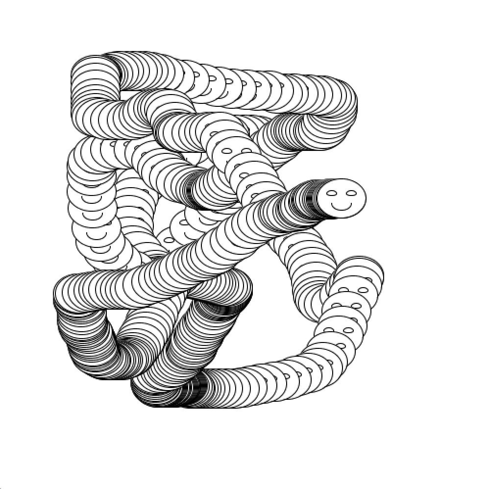
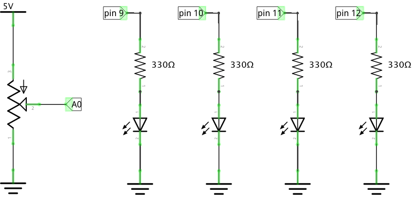
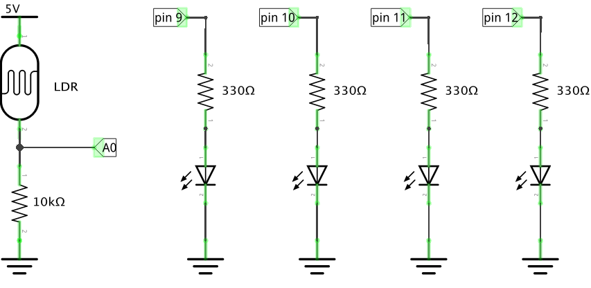
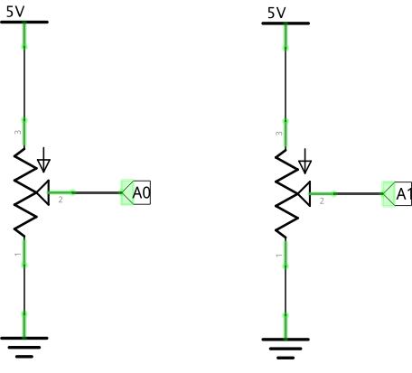
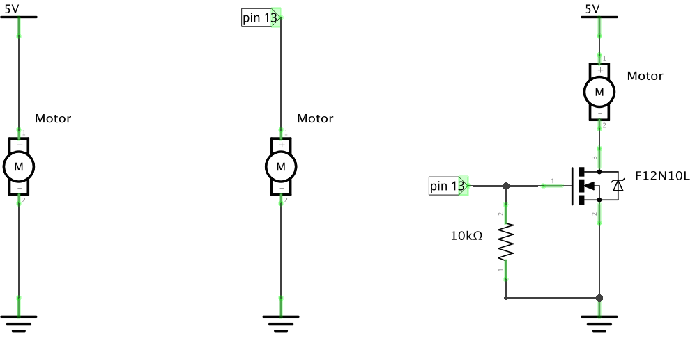
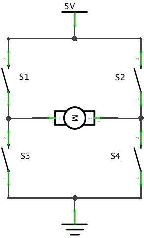
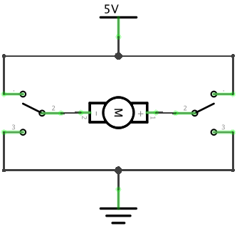
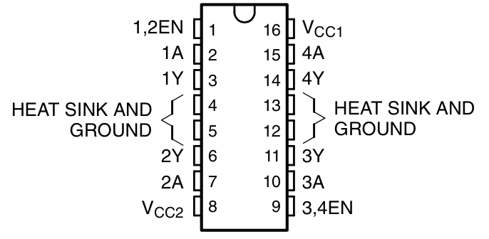

# CCA Programming & Electronics, Spring 2015

This course repository contains homework assignments, useful guides, and code for "Programming & Electronics" at CCA, Spring 2015.

### Week 1: Wednesday, January 21, 2015

Lecture:
- Inspirational Videos
- Introductions
- Goals & course details

Hands-on:
- Human Embodiment of Programmer & Robot
  - Programs generally run line-by-line.
  - While loops, if statements, and functions break that up.
- A quick look at the Remote Control Robot code

Videos:
- Basic robots
  - [Coffee-can robot](http://www.youtube.com/watch?v=b0mIshBIbvI#t=24)
  - [Tree-climbing robot](http://www.youtube.com/watch?v=zkpH1BjD6Wc)
  - [Self-balancing robot](http://www.youtube.com/watch?v=Tw9Jr-SPL0Y)
  - [Insect robot](http://www.youtube.com/watch?v=tOsNXg2vAd4#t=120)
  - [Treadbot](http://www.youtube.com/watch?v=YblSltHDbIU)
  - [Velociraptor robot](http://www.youtube.com/watch?v=lPEg83vF_Tw)
- Drink-makers
  - [Textspresso](http://www.youtube.com/watch?v=kx9D74t7GD8#t=89)
  - [The Inebriator](http://www.youtube.com/watch?v=WqY7fchs7H0)
- Art bots
  - [Floating Couch](http://vimeo.com/72826106)
  - [Wooden Segment Mirror](https://www.youtube.com/watch?v=BZysu9QcceM#t=36)
  - [Cubli: Floating Cube](https://www.youtube.com/watch?v=n_6p-1J551Y)
  - [Arc-o-matic](http://vimeo.com/57082262#at=130)
  - [Robo Faber](http://vimeo.com/78771257)
  - [Eggbot](https://www.youtube.com/watch?v=w4cdbV2oaEc)
- Computer Numerical Control (CNC)
  - [Shapoko / tinyg](http://www.youtube.com/watch?v=pCC1GXnYfFI#t=11)
  - [Makerbot Replicator](http://www.youtube.com/watch?v=NAbiAzYhTOQ)
- Music
  - [Laser harp](http://www.youtube.com/watch?v=sLVXmsbVwUs#t=20)
- Vacuuming
  - [Roomba](https://www.youtube.com/watch?v=0DNkbZvVYvc)

[Homework for Week 1](hw/week1.md)

### Week 2: Wednesday, January 28, 2015

Lecture:
- Homework Review

Lab:
- Creating sketches. Write code to create the following sketches in Processing:

1. 

2. 

3. 

4. [](http://www.youtube.com/watch?v=jWNXFlGHuPA)

5. 

6. Look through the [Processing reference](http://processing.org/reference). Pick a function, and use it in a new sketch of your own choosing.

[Homework for Week 2](hw/week2.md)
   
### Week 3: Wednesday, February 4, 2015

Lecture:
- Homework Review

Lab:
- Arrays
- More Processing sketches

[Homework for Week 3](hw/week3.md)

### Week 4: Wednesday, February 11, 2015

Lecture:
- Arduino! 
- Electronics!

Lab:
- Working with electronics

[Homework for Week 4](hw/week4.md)

### Week 5: Wednesday, February 18, 2015

Lecture:
- Schematic how-to.
  - See [Make's guide to building a breadboard from a schematic](http://makezine.com/2012/04/02/going-from-schematic-to-breadboard/)
  - Also see [Paul Spinrad's guide to reading schematics](http://blog.makezine.com/archive/2011/01/reading-circuit-diagrams.html) and [Collin's video version](http://makezine.com/2011/11/15/collins-lab-schematics/)

Lab:
-   Start with example AnalogInOutSerial (File > Examples > Analog > AnalogInOutSerial). Here's a simplified version of that code:
    ```arduino
    const int analogInPin = A0;  // Analog input pin that the potentiometer is attached to
    const int analogOutPin = 9; // Analog output pin that the LED is attached to

    int sensorValue = 0;        // value read from the pot
    int outputValue = 0;        // value output to the PWM (analog out)

    void setup() {
      // initialize serial communications at 9600 bps:
      Serial.begin(9600);
      pinMode(analogOutPin, OUTPUT);
    }

    void loop() {
      // read the analog in value:
      sensorValue = analogRead(analogInPin);            
      // map it to the range of the analog out:
      outputValue = map(sensorValue, 0, 1023, 0, 255);  
      // change the analog out value:
      analogWrite(analogOutPin, outputValue);           

      // print the results to the serial monitor:
      Serial.print("sensor = " );                       
      Serial.print(sensorValue);      
      Serial.print("\t output = ");      
      Serial.println(outputValue);   

      // wait 2 milliseconds before the next loop
      // for the analog-to-digital converter to settle
      // after the last reading:
      delay(2);                     
    }
    ```
    Make sure you understand what this code does. If not, ask! Here's a schematic of what your circuit should look like:
    
    
    
    Open the serial monitor and see what numbers are printed when you rotate the potentiometer. What's the lowest number you see? Highest?
    
    1. Modify the code so that instead of changing the brightness of the LED, the Arduino turns on or off the LED (using `digitalWrite` instead of `analogWrite`) depending on whether `outputValue` is greater or less than `127`. (Hint: You'll need an `if` statement. What's the `if` statement's condition?)

    2. Add 3 more LEDs (4 total) on pins 10, 11, and 12. (Create new variables for the pins they're connected to.) Here's a new schematic:
       
    
    3. Add new `if` statements so that the 4 LEDs make a "level meter": as you turn the potentiometer from left to right, the LEDs turn on one by one until they're all on when you've turned the potentiometer all the way.
    
    4. Replace the potentiometer in this circuit with a light-dependent resistor (LDR) in a voltage divider circuit. Here's what you should have:
    
       
      
       What happens when you cover the LDR?
       
       Open the serial monitor and see what numbers are printed when you cover and uncover the LDR. What's the lowest number you see? Highest?
    
    5. *Show me your breadboard before moving on.*
    
    6. Replace your LDR with a button. Here's what you should have:
    
       
    
       What happens?
       
       Open the serial monitor and see what numbers are printed when you push and release the button. What's the lowest number you see? Highest?
       
       Replace the `analogRead` function with `digitalRead`. What happens in the serial monitor now?
    
-   Use Arduino and Procesing function to create a digital [Etch-a-Sketch](https://www.youtube.com/watch?v=CAGcFy6CYnM#t=120s). 
    
    1. Connect two potentiometers to analog pins `A0` and `A1`. Here's a schematic:
    
       
    
    2. Write an Arduino sketch, using the `Serial` library, that reads the two analog inputs (using `analogRead`) and prints those values to serial port, two per line, separated by commas. The outputs should look like this in the serial monitor:

       ```
       253,124
       253,176
       253,182
       ...
       ```
    
       You will likely need both `Serial.print` and `Serial.println`. The first number should correspond to the value from pin `A0`, and the second from pin `A1`.
    
    3. Here's a Processing sketch that reads these pairs of numbers from the serial port, and then draws a line from the old coordinate to the new coordinate. But it has a bug! So it doesn't quite work. Fix the bug. (Hint: the bug isn't with the `readSerial` function!)
    
       ```processing
       // Etch-a-Sketch
       // based on a sketch by Trevor Shannon

       import processing.serial.*;

       Serial port;
       int oldX = -1;
       int oldY = -1;

       void setup() {
         size(512, 512);
         background(255);
         port = new Serial(this, Serial.list()[Serial.list().length-1], 9600);  
       }

       void drawNextLine(int x, int y) {
         if (oldX >= 0 && oldY >= 0) {
           // draw a line from the old x,y coordinates to the new x,y coordinates
           line(x, y, oldX, oldY);
         }

         // update the "old" x,y coordinates for the next frame
         oldX = x;
         oldY = x;
       }  

       void draw() {
         int[] values = readSerial(2);
         if (values != null) {
           drawNextLine(values[0], values[1]);
         }
       }

       void mouseClicked() {
         background(255);
       }

       int[] readSerial(int minValues) {  
         int x; int y;
         String s = port.readStringUntil('\n');
         if (s != null) {
           String[] parts = s.substring(0, s.length()-2).split(",");
           int[] values = new int[parts.length];
           for (int i = 0; i < parts.length; i++) {
             values[i] = int(parts[i]);
           }
           if (values.length < minValues) {
             return null;
           } else {
             return values;
           } 
         } else {
           return null;
         }
       }
       ```
    
    4. Replace the potentiometer on pin `A1` with a sensing resistor of your choice in a voltage divider -- you can use an LDR like in the previous example, or a force-sensitive resistor, or a thermistor, or... A digital multimeter may help in picking the right corresponding resistor.
    
    5. Modify the Processing code so that it draws a graph of the value of the second coordinate only (that is, the number that changes when you rotate the potentiometer that you've connected to pin `A1`).
       
       You'll need to modify the `drawNextLine` function so that it doesn't draw a line from `x`,`y` to `oldX`,`oldY` anymore. Instead, it will use a slowly-increasing `x` coordinate. Try these two changes:
       
       1. Create a new variable called `columnPosition` and use that instead of `x` in the `line` function. 
       
       2. Increase `columnPosition` a little bit on every frame.
    
    6. **Challenge**: Also graph the value of the first coordinate!

Homework: Practice programming and finish [homework 4](hw/week4.md) if you haven't yet! (Especially the code tracing exercise.)
  
### Week 6: Wednesday, February 25, 2015

Lecture:
- Voltage dividers, current, resistance. V=IR.

Lab:
-   Playing with voltage dividers!

    1.   Build a two-resistor circuit:

         
         
    2. Write a simple Arduino sketch that reads from the analog input pin `A0` and writes to the Serial port. Open the serial monitor and observe the (unchanging) value.
    
    3. Measure the voltage across each resistor using a digital multimeter. (What do the voltages add to?)
    
    4. Replace the resistors in your circuit with new resistors with different values. What happens to the serial monitor output? What happens to the voltage?
    
    5. Replace one of the resistors with a resistive sensor. Actuate it, and observe the serial monitor values change as well as the multimeter values.

-   More electronics experiments! Continue the labs from Week 5.

Review:
-  Tracing code (homework exercise)

-  Writing code
  
  -  Break down the problem into parts. Is there are repeating component? Use a `while` loop. Does something happen only under specific circumstances? Use an `if` statement. Are you tracking something changing over time or as you draw? Use a variable: `int` or `float`, depending on what kind of thing you're tracking.

-  Breadboarding a schematic
  1.  Wire up the + and - lines to 5V and GND.
  2.  Place each component so that the seprate leads are in (electrically) seprate columns on the breadboard.
  3.  Place wires between the components so that connected component leads are connected.

Homework: Do the practice quiz. Get it at [Homework 6](hw/week6.md).

### Week 7: Wednesday, March 4, 2015

Midterm!

Discussion of where the class should go in the remaining weeks.

### Week 8: Wednesday, March 11, 2015

Lecture:
-  Motors, transistors, and motor drivers.

Lab:
-  Experiments with motors!
   
1. Build the following circuits, one at a time, and observe what happens. Pay particular attention to the speed and strength of the motors. (For the latter two schematics, use the blink sketch or write your own.)
  
   

2. In the third schematic above, you're using the transistor as a digital switch. As we discussed, you can control a motor using 4 switches in this configuration, called an H-Bridge:
  
   

3. Using switches `S1`, `S2`, `S3`, and `S4`, figure out how to open or close each switch to cause current to flow from left to right through the motor (spinning it "forward") and from right to left through the motor (spinning it "backward"). Make a handy table.

4. Note that your table never has switches `S1` and `S3` both closed or `S2` and `S4` both closed -- why?

5. That means that the circuit we want is effectively this:

   
  
6. This schematic merges `S1` and `S3` into a single switch on the left, and `S2` and `S4` into a single switch on the right. For each switch, there are now three positions: up, down, or "off" (that is, not connected to anything). 

7. This circuit is created for us in the form of a "Half-H Bridge" integrated circuit. We'll use the [SN7544](http://www.ti.com/lit/ds/symlink/sn754410.pdf) in class -- but there are many others (like the [L293D](http://www.ti.com/lit/ds/symlink/l293d.pdf)), with the main difference being voltage and current ratings. Here's what it looks like. Note the position of the notch.
  
   
  
8. The inputs to the chip are the pins labeled with `A`, e.g., `1A`, `2A`, etc. The corresponding outputs (that you connect to your motor) are the pins labeled with `Y`, e.g., `1Y`, `2Y`. Send a high voltage on the input pin, and the output pin will be connected to a high voltage -- and similarly with low voltage.

9. Wire up your motor to one side of the H-bridge.

10. Write a function in Arduino, `void forward()`, that spins the motor forward, using pins connected to `1A` and `2A`

11. Write an analogous function, `void reverse()`, for the reverse.

12. Write an Arduino sketch that uses your two functions to spin the motor forward for 2 seconds, waits for 1 second, then reverses for 1 second.

13. Add a potentiometer to your sketch -- when rotated one way, the motor should spin in one direction, when rotated the other way, the motor should spin in the other direction. In the middle range, the motor shouldn't spin at all. (What code can you write to stop the motor?)

14. Add a second motor, connect it to the other half of the integrated circuit.

Homework: Refresh today's class and learn more programming in [homework 8](hw/week8.md).


### Week 9: Wednesday, March 18, 2015

Lecture:
-  Homework review.

Lab:
-  Continuation of motor experiments!

1. Build the following circuit:
   
   

2. Attach your motors to the bottom of a cardboard box or similar chassis.

3. Write a function in Arduino, `void forward()`, that spins both motors forward.

4. Write an analogous function, `void reverse()`, that spins both motors backwards.

5. Write functions for `left`, `right`, and `stop`.

6. Attach an input to your motorized box: this may be a remote control receiver, a potentiometer "steering wheel", a distance sensor, light sensors, or anything else you want to try. Use the functions you defined in steps 3-5 to control your motorized box.

7. Modify your circuit to add speed control for your motors: you can do this by connecting the `EN` (enable) pin for each motor to a PWM-capable output pin on the Arduino, and then using `analogWrite` on that output pin.

Homework: Draft a project proposal and practice programming in [homework 9](hw/week9.md).

### Week 10: Wednesday, April 1, 2015

Lecture:
- Quiz questions
- Project discussions
- Classes Overview

In today's session, we looked at how you might transform a piece of code that shows a ball bouncing around a screen to use classes. Here's a graphic showing what we did, exactly:


In the diagram above, the blue boxes show the modified code; the left side of each blue box pair shows the traditional code, while the right side shows the class-enabled code. The red arrows show where inside the `Ball` class the actual code goes.

The variables tracking the position, speed, and radius of the ball, as well as the code for drawing and moving the ball, are all put into the class `Ball`. We say that the variables and functions are "encapsulated" in the `Ball` class. In Processing, `Ball` now describes a new type, like `int` or `float`, but more complex, a "compound" type. Whenever we create an "instance" of the `Ball` class, by writing `new Ball()`, we are creating a new **container** object that includes its own `x`, `y`, `vx`, `vy`, and `radius` variables -- the instance we create **contains** those 5 other variables. Then the `draw` and `move` functions are called **on an object**, for example, `b.move()` is the `move` function of the `b` object, it only uses and alters the variables inside the `b` object.

You can create as many instances of a class as you like, giving them different names (for example, `Ball b2 = new Ball()`) or storing them in arrays. Each will be independent, and calling a function on one object will only affect that one object's variables.

Try it in the homework!

Homework: Play with the code we wrote in class and write up a project proposal in [homework 10](hw/week10.md).

