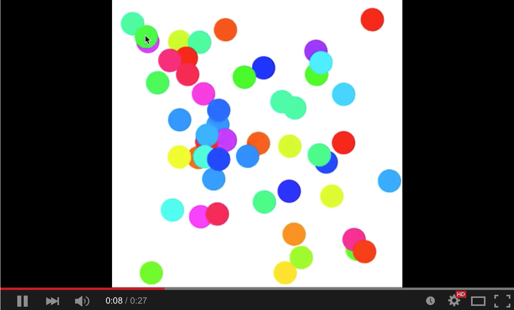

# CCA Programming & Electronics, Spring 2015

This course repository contains homework assignments, useful guides, and code for "Programming & Electronics" at CCA, Spring 2015.

### Week 1: Wednesday, January 21, 2015

Lecture:
- Inspirational Videos
- Introductions
- Goals & course details

Hands-on:
- Human Embodiment of Programmer & Robot
  - Programs generally run line-by-line.
  - While loops, if statements, and functions break that up.
- A quick look at the Remote Control Robot code

Videos:
- Basic robots
  - [Coffee-can robot](http://www.youtube.com/watch?v=b0mIshBIbvI#t=24)
  - [Tree-climbing robot](http://www.youtube.com/watch?v=zkpH1BjD6Wc)
  - [Self-balancing robot](http://www.youtube.com/watch?v=Tw9Jr-SPL0Y)
  - [Insect robot](http://www.youtube.com/watch?v=tOsNXg2vAd4#t=120)
  - [Treadbot](http://www.youtube.com/watch?v=YblSltHDbIU)
  - [Velociraptor robot](http://www.youtube.com/watch?v=lPEg83vF_Tw)
- Drink-makers
  - [Textspresso](http://www.youtube.com/watch?v=kx9D74t7GD8#t=89)
  - [The Inebriator](http://www.youtube.com/watch?v=WqY7fchs7H0)
- Art bots
  - [Floating Couch](http://vimeo.com/72826106)
  - [Wooden Segment Mirror](https://www.youtube.com/watch?v=BZysu9QcceM#t=36)
  - [Cubli: Floating Cube](https://www.youtube.com/watch?v=n_6p-1J551Y)
  - [Arc-o-matic](http://vimeo.com/57082262#at=130)
  - [Robo Faber](http://vimeo.com/78771257)
  - [Eggbot](https://www.youtube.com/watch?v=w4cdbV2oaEc)
- Computer Numerical Control (CNC)
  - [Shapoko / tinyg](http://www.youtube.com/watch?v=pCC1GXnYfFI#t=11)
  - [Makerbot Replicator](http://www.youtube.com/watch?v=NAbiAzYhTOQ)
- Music
  - [Laser harp](http://www.youtube.com/watch?v=sLVXmsbVwUs#t=20)
- Vacuuming
  - [Roomba](https://www.youtube.com/watch?v=0DNkbZvVYvc)


#### Homework 1 (due Wednesday, January 28, 2015)

- Solve the puzzles through level 5 at [Rudy the Red Dot](http://rudy.zamfi.net) -- these are the puzzles we solved together using "pseudocode" in class, but now you will solve them with actual code, in JavaScript. 
  
  *(The website is running on my computer at home, so it may load a bit slowly. Also, if the <strong>Run</strong> button seems to stop working, reload the page. Best results with the Chrome browser.)*

    - For puzzles that change, each time you hit the **Run** button, you'll get a new version of the puzzle. Your code should solve any variation of the puzzle you can get. Start by clicking **Run** a few times to make sure you remember what the possible variations are.
    - There's a cheat sheet of syntax on the right, under the puzzle itself.
    - **Assignment: Use at least 3 functions of at least 3 lines each while computing these puzzles.**
    - **Assignment: Use a while loop for puzzles 4 and 5.**
    - **Assignment: Email me a link to your final level (not the code, the actual URL link -- like http://rudy.zamfi.net/whatever) to [jzamfirescupereira@cca.edu](mailto: jzamfirescupereira@cca.edu) with subject RUDY FINAL LEVEL LINK by 11am, Wednesday January 28.**

- If you find yourself struggling with the basic concepts of the code, complete through puzzle 20 at [Hour of Code](http://learn.code.org/hoc/1) -- make sure you click the **Show Code** button after solving each puzzle and that you understand how that code works.

- Install [Processing](https://processing.org/download/?processing) on your computer.

- **Assignment: Follow the first 5 [Processing tutorials](https://processing.org/tutorials/)**

- **Assignment: Get extra help by going to the Hybrid Lab during staffed hours (I believe 10am-8pm) and asking the coaches for help!**

- **Assignment: Bring your computer to class on Wednesday, January 28!**

Please email me at [jzamfirescupereira@cca.edu](mailto: jzamfirescupereira@cca.edu) if you're stuck, aren't sure how to move forward, or just want to say hi! (And if you're stuck on Rudy, include the URL link to the puzzle you're stuck on!)

### Week 2: Wednesday, January 28, 2015

Lecture:
- Homework Review

Lab:
- Creating sketches. Write code to create the following sketches in Processing:

1. 

2. 

3. 

4. [](http://www.youtube.com/watch?v=jWNXFlGHuPA)

5. 

6. Look through the [Processing reference](http://processing.org/reference). Pick a function, and use it in a new sketch of your own choosing.


#### Homework 2 (due Wednesday, February 4, 2015)

Programming Practice!

- **Assignment: Pick 5 of the 15 sketches below and recreate them, at least one must be animated.** Bonus points for adding flourishes to your sketches. Include the sketch number and your CCA username in the file name, and email them to me at [jzamfirescupereira@cca.edu](mailto:jzamfirescupereira@cca.edu) by 11am, Wednesday, February 4.

- Not all these sketches are equally difficult -- in fact some are very challenging!

- If you didn't follow all the [Processing tutorials](https://processing.org/tutorials/) last week, then **Assignment: Do so now!**

- It may help to read through the [Processing reference](http://processing.org/reference/) to understand all the various functions available to you.

- For extra programming help, consider following the [Khan Academy programming tutorials using Processing](https://www.khanacademy.org/computing/computer-programming/programming).

Without further ado, here are the sketches:

1. Circles in a diagonal line. Use a while loop to draw the balls in sequence. What do you know about the x and y coordinates of each ball? (Spoiler: They're the same!)
   
   

2. Circles in a grid. You will likely need a while loop inside another while loop!
   
   

3. Colored circles in a grid, random version. Check out the `colorMode` function, and HSB, in the [Processing reference](http://processing.org/reference).
   
   

4. Colored circles in a grid, sequential version. Check out the `colorMode` function, and HSB, in the [Processing reference](http://processing.org/reference).

   

5. Circles in an triangle.

   
   
6. Circles in an hourglass.

   

7. The grid.
   
   
   
8. Diagonal lines.

   

9. Diagonal lines, interrupted.

   

10. Random bars.

   

11. Random bars, animated.

   [](http://youtu.be/EA9MqlY56LM)

12. Animated bars, mouse-sensitive. Check out the Processing-defined variables `mouseX` and `mouseY` in the [Processing reference](http://processing.org/reference).

   [](http://youtu.be/3OAKqXS5Lkw)

13. Bouncing balls, just two.

   [](http://youtu.be/7sfC4-4VoM4)

14. **Challenge:** Bouncing balls, more added by clicking. You may need to use an `ArrayList`.

   [](http://youtu.be/Tnkhya3Tqu0)

15. **Challenge:** Fireworks! They should track the mouse and appear on clicks.

   [](http://youtu.be/yNTUEe9cof8)
   
   
### Week 3: Wednesday, February 4, 2015

Lecture:
- Homework Review

Lab:
- Arrays
- More Processing sketches


#### Homework 3 (due Wednesday February 11, 2015)

1. Prepare for our Arduino and electronics sessions by:
  - **Assignment: Read these tutorials:**
    - https://learn.sparkfun.com/tutorials/what-is-electricity
    - https://learn.sparkfun.com/tutorials/voltage-current-resistance-and-ohms-law
    - http://www.allaboutcircuits.com/vol_1/chpt_1/index.html
    - http://www.allaboutcircuits.com/vol_1/chpt_2/index.html 
  - Watch these videos:
    - https://www.youtube.com/watch?v=exlRjDKHGRg
    - https://www.youtube.com/watch?v=mzSnz6ZDkFE

2. Programming Practice:
  - Pick two additional sketches from [last week's list of 15](#homework-2-due-wednesday-february-4-2015) and create them in Processing.
  - In the Pulsed Line sketch below, try the following changes:
      - Change the phase increase (currently 0.17) so that each pulse takes up the full width of the canvas.
      
      - Color the lines rainbow-style, like in homework 2, exercise 4; have the color start over from red when you click; have the color fade to white as the pulse height drops to 0.

      - Use `rect` instead of `line`.
    ```
    /**
     * Pulsed Lines
     *
     * Click to pulse.
     */ 
    float amplitude, phase;

    void setup() {
      size(500, 500);
      background(0);
      amplitude = height * .9;
      phase = PI/8;
    }

    float x = 0;

    void draw() {
      stroke(0);
      strokeWeight(3);
      line(x, 0, x, height);
  
      float magnitude = amplitude/2 * sin(phase);
      stroke(255);
      strokeWeight(2);
      line (x, height/2-magnitude, x, height/2+magnitude);
  
      x = x + 5;
      amplitude = amplitude * 0.97;
      phase = phase + 0.17;
  
      if (x > width) {
        x = 0;
      } 
    }

    void mousePressed() {
      amplitude = height * .9;
      phase = PI/8;
    }
    ```
    
  - Load the PolygonPShape example, and modify it to draw a 7-pointed star instead of a 5-pointed one: 
    ```
    /**
     * PolygonPShape. 
     * 
     * Using a PShape to display a custom polygon. 
     */

    // The PShape object
    PShape star;

    void setup() {
      size(640, 360, P2D);
      smooth();
      // First create the shape
      star = createShape();
      star.beginShape();
      // You can set fill and stroke
      star.fill(102);
      star.stroke(255);
      star.strokeWeight(2);
      // Here, we are hardcoding a series of vertices
      star.vertex(0, -50);
      star.vertex(14, -20);
      star.vertex(47, -15);
      star.vertex(23, 7);
      star.vertex(29, 40);
      star.vertex(0, 25);
      star.vertex(-29, 40);
      star.vertex(-23, 7);
      star.vertex(-47, -15);
      star.vertex(-14, -20);
      star.endShape(CLOSE);
    }

    void draw() {
      background(51);
      // We can use translate to move the PShape
      translate(mouseX, mouseY);
      // Display the shape
      shape(star);
    }
    ```

### Week 4: Wednesday, February 11, 2015

Lecture:
- Arduino! 
- Electronics!

Lab:
- Working with electronics


#### Homework 4 (due Wednesday February 18, 2015)

1. Arduino Labs:
  - **Assignment:** Complete this lab: http://workshopweekend.net/arduino/labs/exploring-color on half of your breadboard.
    
    You'll need extra parts: more wires, an RGB LED, and two additional potentiometers, all of which you can get from the Hybrid Lab. (I recommend actually doing the assignment at the Hybrid Lab, where there will be monitors and coaches who can help you!)
    
    **Send me your final code by 11am, Wednesday, Feb 18. Bring your breadboard with your completed project to Wednesday's class.**
  
  - **Assignment:** Complete this lab: http://workshopweekend.net/arduino/labs/exploring-signals on the other half of your breadboard.
    
    You'll need extra parts here too: more LEDs, a light-dependent resistor (LDR), and a 10K resistor, all of which you can also get from the Hybrid Lab. (Do this assignment at the Hybrid Lab too!)
    
    **Send me your final code by 11am, Wednesday, Feb 18. Bring your breadboard with your completed project to Wednesday's class.**

2. Math Practice. Follow these directions:
  1. Sign up at khanacademy.org (or log in with their existing accounts)
  2. Visit http://khanacademy.org/coaches
  3. There, in the "Add a coach" field, enter the class code **Q9XFRS**
  4. **Assignment:** Spend an hour working through topics you don't know well! Especially useful will be the sections on expressions, manupulating expressions, and equations and inequality.

3. Programming Practice.
  1. **Assignment:** Run the code in [this pdf](tracing-exercise.pdf) as though you are the computer. *(This exercise is required for everyone.)*
    1. For each new variable, add a new entry to the Computer Memory table.
    2. For every change in a variable's value, update the entry in the table, legibly crossing out the old value, like this update from 3 to 4: 
    3. For every drawing command, draw the result on the canvas. (This exercise is all monochrome.)
    4. Tally (or draw a line or dot) to the left of each line as you evaluate it.
    5. Bring in the printed exercise sheet with you to class, or scan and email it to me before class.
  2. Take these two individual sketches, and add color in some interactive way. *(Or, send me other code you wrote this week.)*
    - Mouse-tracking Circles
      ```
      /**
       * Mouse-tracking Circles
       *
       * A grid of circles whose size depends on distance from the mouse.
       */
      final int GRID_SIZE = 10;
      final float GRID_PADDING = 50;
      final int CANVAS_SIZE = 500;

      void setup() {
        size(CANVAS_SIZE, CANVAS_SIZE);
      }

      float gridToCoordinates(int input) {
        return GRID_PADDING+input*(CANVAS_SIZE - 2*GRID_PADDING)/(GRID_SIZE-1);
      }

      void draw() {
        background(0);

        noStroke();
        fill(255);
        for (int i = 0; i < GRID_SIZE; ++i) {
          for (int j = 0; j < GRID_SIZE; ++j) {
            float distance = sqrt(pow(mouseX-gridToCoordinates(i), 2) + pow(mouseY-gridToCoordinates(j), 2));
            float ellipseSize = min(40, 1000.0/distance);
            ellipse(gridToCoordinates(i), gridToCoordinates(j), ellipseSize, ellipseSize);
          }
        }
      }
      ```
    - Hyper Circles
      ```
      final int GRID_SIZE = 10;
      final float GRID_PADDING = 50;
      final int CANVAS_SIZE = 500;
      final float FRACTION_PER_FRAME = .25;
      final int MAX_HISTORY_POINTS = 40;

      // track the origin and destination for each line
      int oldX, oldY;
      int newX, newY;

      float fraction = 0;

      ArrayList<PVector> historyPoints;

      void setup() {
        size(CANVAS_SIZE, CANVAS_SIZE);

        newX = floor(random(GRID_SIZE));
        newY = floor(random(GRID_SIZE));

        historyPoints = new ArrayList<PVector>();
        setNewDestination();
      }

      void setNewDestination() {
        fraction = 0;
        oldX = newX;
        oldY = newY;
        newX = floor(random(GRID_SIZE));
        newY = floor(random(GRID_SIZE));

        // add the old destination to the history
        historyPoints.add(0, new PVector(oldX, oldY));

        // remove any extra history points.
        while (historyPoints.size () > MAX_HISTORY_POINTS) {
          historyPoints.remove(historyPoints.size()-1);
        }
      }

      float gridToCoordinates(float input) {
        return GRID_PADDING+input*(CANVAS_SIZE - 2*GRID_PADDING)/(GRID_SIZE-1);
      }

      void drawHistory() {
        fill(255);
        noStroke();
        for (int i = 0; i < historyPoints.size (); i++) {
          PVector hp = historyPoints.get(i);
          // draw progressively smaller circles for each historical point.
          ellipse(gridToCoordinates(hp.x), gridToCoordinates(hp.y), MAX_HISTORY_POINTS-i, MAX_HISTORY_POINTS-i);
        }
      }  

      void drawGrid() {
        fill(255);
        noStroke();
        for (int i = 0; i < GRID_SIZE; i++) {
          for (int j = 0; j < GRID_SIZE; j++) {
            ellipse(gridToCoordinates(i), gridToCoordinates(j), 3, 3);
          }
        }
      }

      void drawLine() {
        stroke(255);
        strokeWeight(4);
        float cOldX = gridToCoordinates(oldX);
        float cOldY = gridToCoordinates(oldY);
        float cNewX = gridToCoordinates(newX);
        float cNewY = gridToCoordinates(newY);

        line(cOldX + (cNewX - cOldX)*fraction, 
             cOldY + (cNewY - cOldY)*fraction, 
             cOldX + (cNewX - cOldX)*min(fraction+FRACTION_PER_FRAME, 1), 
             cOldY + (cNewY - cOldY)*min(fraction+FRACTION_PER_FRAME, 1));
      }

      void draw() {
        background(0);
        if (fraction >= 1) {
          setNewDestination();
        }

        drawHistory();
        drawGrid();
        drawLine();

        if (! mousePressed) {
          fraction += FRACTION_PER_FRAME;
        }
      }
      ```
