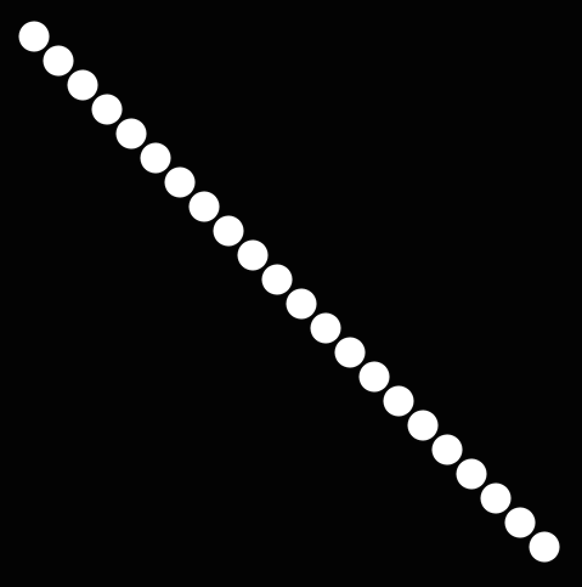
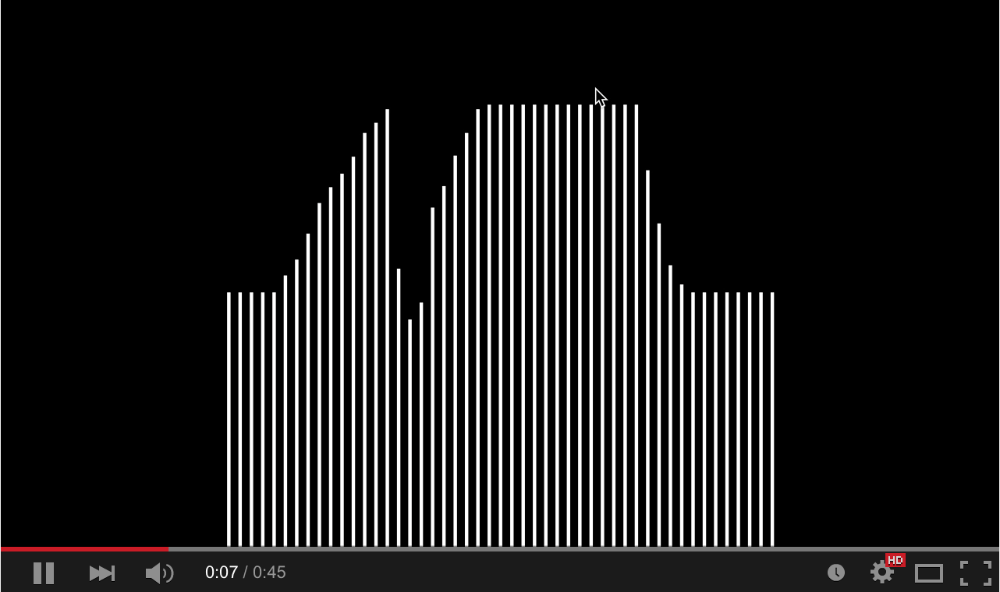

### Homework 2 (due Wednesday, February 4, 2015)

Programming Practice!

- **Assignment: Pick 5 of the 15 sketches below and recreate them, at least one must be animated.** Bonus points for adding flourishes to your sketches. Include the sketch number and your CCA username in the file name, and email them to me at [jzamfirescupereira@cca.edu](mailto:jzamfirescupereira@cca.edu) by 11am, Wednesday, February 4.

- Not all these sketches are equally difficult -- in fact some are very challenging!

- If you didn't follow all the [Processing tutorials](https://processing.org/tutorials/) last week, then **Assignment: Do so now!**

- It may help to read through the [Processing reference](http://processing.org/reference/) to understand all the various functions available to you.

- For extra programming help, consider following the [Khan Academy programming tutorials using Processing](https://www.khanacademy.org/computing/computer-programming/programming).

Without further ado, here are the sketches:

1. Circles in a diagonal line. Use a while loop to draw the balls in sequence. What do you know about the x and y coordinates of each ball? (Spoiler: They're the same!)
   
   

2. Circles in a grid. You will likely need a while loop inside another while loop!
   
   

3. Colored circles in a grid, random version. Check out the `colorMode` function, and HSB, in the [Processing reference](http://processing.org/reference).
   
   

4. Colored circles in a grid, sequential version. Check out the `colorMode` function, and HSB, in the [Processing reference](http://processing.org/reference).

   

5. Circles in an triangle.

   
   
6. Circles in an hourglass.

   

7. The grid.
   
   
   
8. Diagonal lines.

   

9. Diagonal lines, interrupted.

   

10. Random bars.

   

11. Random bars, animated.

   

12. Animated bars, mouse-sensitive. Check out the Processing-defined variables `mouseX` and `mouseY` in the [Processing reference](http://processing.org/reference).

   

13. Bouncing balls, just two.

   

14. **Challenge:** Bouncing balls, more added by clicking. You may need to use an `ArrayList`.

   

15. **Challenge:** Fireworks! They should track the mouse and appear on clicks.

   
   