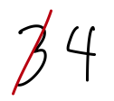

### Homework 4 (due Wednesday February 18, 2015)

1. Arduino Labs:
  - **Assignment:** Complete this lab: http://workshopweekend.net/arduino/labs/exploring-color on half of your breadboard.
    
    You'll need extra parts: more wires, an RGB LED, and two additional potentiometers, all of which you can get from the Hybrid Lab. (I recommend actually doing the assignment at the Hybrid Lab, where there will be monitors and coaches who can help you!)
    
    **Send me your final code by 11am, Wednesday, Feb 18, to [jzamfirescupereira@cca.edu](mailto:jzamfirescupereira@cca.edu). Bring your breadboard with your completed project to Wednesday's class.**
  
  - **Assignment:** Complete this lab: http://workshopweekend.net/arduino/labs/exploring-signals on the other half of your breadboard.
    
    You'll need extra parts here too: more LEDs, a light-dependent resistor (LDR), and a 10K resistor, all of which you can also get from the Hybrid Lab. (Do this assignment at the Hybrid Lab too!)
    
    **Send me your final code by 11am, Wednesday, Feb 18, to [jzamfirescupereira@cca.edu](mailto:jzamfirescupereira@cca.edu). Bring your breadboard with your completed project to Wednesday's class.**

2. Math Practice. Follow these directions:
  1. Sign up at http://khanacademy.org (or log in with your existing account)
  2. Visit http://khanacademy.org/coaches
  3. In the "Add a coach" field, enter the class code **Q9XFRS**
  4. **Assignment:** Spend an hour working through topics you don't know well! Especially useful will be the sections on expressions, manupulating expressions, and equations and inequality.

3. Programming Practice.
  1. **Assignment:** Run the code in [this pdf](tracing-exercise.pdf) as though you are the computer. *(This exercise is required for everyone.)*
    1. For each new variable, add a new entry to the Computer Memory table.
    2. For every change in a variable's value, update the entry in the table, legibly crossing out the old value, like this update from 3 to 4:
      
      
    3. For every drawing command, draw the result on the canvas. (This exercise is all monochrome.)
    4. Tally (or draw a line or dot) to the left of each line as you evaluate it.
    5. Bring in the printed exercise sheet with you to class, or scan and email it to me before class.
  2. Take these two individual sketches, and add color in some interactive way. *(Or, send me other code you wrote this week.)*
    - Mouse-tracking Circles
      ```processing
      /**
       * Mouse-tracking Circles
       *
       * A grid of circles whose size depends on distance from the mouse.
       */
      final int GRID_SIZE = 10;
      final float GRID_PADDING = 50;
      final int CANVAS_SIZE = 500;

      void setup() {
        size(CANVAS_SIZE, CANVAS_SIZE);
      }

      float gridToCoordinates(int input) {
        return GRID_PADDING+input*(CANVAS_SIZE - 2*GRID_PADDING)/(GRID_SIZE-1);
      }

      void draw() {
        background(0);

        noStroke();
        fill(255);
        for (int i = 0; i < GRID_SIZE; ++i) {
          for (int j = 0; j < GRID_SIZE; ++j) {
            float distance = sqrt(pow(mouseX-gridToCoordinates(i), 2) + pow(mouseY-gridToCoordinates(j), 2));
            float ellipseSize = min(40, 1000.0/distance);
            ellipse(gridToCoordinates(i), gridToCoordinates(j), ellipseSize, ellipseSize);
          }
        }
      }
      ```
    - Hyper Circles
      ```processing
      final int GRID_SIZE = 10;
      final float GRID_PADDING = 50;
      final int CANVAS_SIZE = 500;
      final float FRACTION_PER_FRAME = .25;
      final int MAX_HISTORY_POINTS = 40;

      // track the origin and destination for each line
      int oldX, oldY;
      int newX, newY;

      float fraction = 0;

      ArrayList<PVector> historyPoints;

      void setup() {
        size(CANVAS_SIZE, CANVAS_SIZE);

        newX = floor(random(GRID_SIZE));
        newY = floor(random(GRID_SIZE));

        historyPoints = new ArrayList<PVector>();
        setNewDestination();
      }

      void setNewDestination() {
        fraction = 0;
        oldX = newX;
        oldY = newY;
        newX = floor(random(GRID_SIZE));
        newY = floor(random(GRID_SIZE));

        // add the old destination to the history
        historyPoints.add(0, new PVector(oldX, oldY));

        // remove any extra history points.
        while (historyPoints.size () > MAX_HISTORY_POINTS) {
          historyPoints.remove(historyPoints.size()-1);
        }
      }

      float gridToCoordinates(float input) {
        return GRID_PADDING+input*(CANVAS_SIZE - 2*GRID_PADDING)/(GRID_SIZE-1);
      }

      void drawHistory() {
        fill(255);
        noStroke();
        for (int i = 0; i < historyPoints.size (); i++) {
          PVector hp = historyPoints.get(i);
          // draw progressively smaller circles for each historical point.
          ellipse(gridToCoordinates(hp.x), gridToCoordinates(hp.y), MAX_HISTORY_POINTS-i, MAX_HISTORY_POINTS-i);
        }
      }  

      void drawGrid() {
        fill(255);
        noStroke();
        for (int i = 0; i < GRID_SIZE; i++) {
          for (int j = 0; j < GRID_SIZE; j++) {
            ellipse(gridToCoordinates(i), gridToCoordinates(j), 3, 3);
          }
        }
      }

      void drawLine() {
        stroke(255);
        strokeWeight(4);
        float cOldX = gridToCoordinates(oldX);
        float cOldY = gridToCoordinates(oldY);
        float cNewX = gridToCoordinates(newX);
        float cNewY = gridToCoordinates(newY);

        line(cOldX + (cNewX - cOldX)*fraction, 
             cOldY + (cNewY - cOldY)*fraction, 
             cOldX + (cNewX - cOldX)*min(fraction+FRACTION_PER_FRAME, 1), 
             cOldY + (cNewY - cOldY)*min(fraction+FRACTION_PER_FRAME, 1));
      }

      void draw() {
        background(0);
        if (fraction >= 1) {
          setNewDestination();
        }

        drawHistory();
        drawGrid();
        drawLine();

        if (! mousePressed) {
          fraction += FRACTION_PER_FRAME;
        }
      }
      ```
