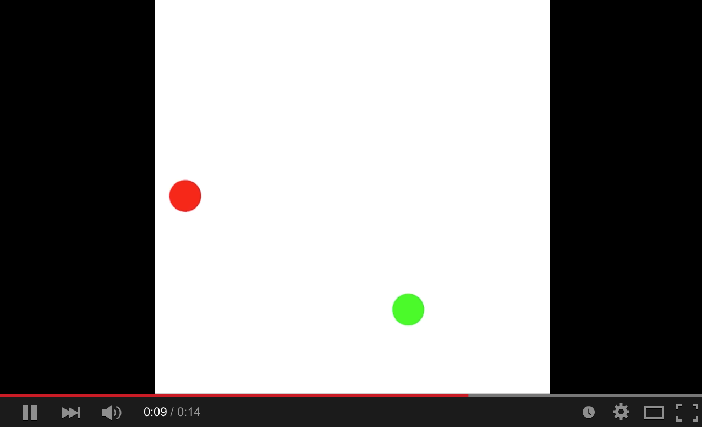

### Homework 9 (due Wednesday, April 1, 2015)

Project:

- Your final project will take up the bulk of your classwork for the rest of term. Think about what you'd like to do, and send me a 5-10 sentence description of what you'd like to do. Here are some thoughts:

  - Your project should have a significant programming component.
  - It should have some kind of input: maybe a sensor or two, a remote control, a touch control, a computer input -- perhaps through Processing?
  - It should have some kind of output: motors, LEDs, a Processing sketch, sound, video playback, a graph of data, etc.
  - It could have a mechanical component.
  - It could have an artistic component.

- Examples of pretty good projects include:
  - Piano player: molded plastic fingers, connected to servo motors with strings, that pull the fingers down to play an electric keyboard. Reads the MIDI format and plays music!
  - SensorBot: a wall-detecting robot that follows the walls in a room, measuring distance and light level as it goes.
  - Wall Drawbot: a wall-mounted pen controlled by an Arduino that can draw an arbitrary drawing, perhaps from an SVG file.

- Be creative! This is your chance to play with the concepts that excite you the most.

- We will likely go through a bit of a back-and-forth to refine your project idea -- the sooner you send it to me the more time you'll have to work on it!

Programming Practice:

- Read through [this tutorial about objects on the Processing site](https://processing.org/tutorials/objects/).
- Implement this animated sketch using objects:
  
  
  
  Define a class, `Ball`, to track the properties of a ball (`x` and `y` position, as well as `x` and `y` velocity -- velocities can be negative!). Create two instances of that class, one for each ball.